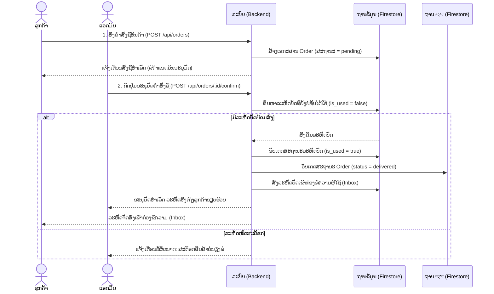

# ເອກະສານສະຖາປັດຕະຍະກຳລະບົບ — Dit Shop (Gift Card Store)

ເອກະສານນີ້ອະທິບາຍສະຖາປັດຕະຍະກຳລະບົບ ແລະ ການເຮັດວຽກຂອງແອັບພລິເຄຊັນ **Dit Shop** ເຊິ່ງເປັນລະບົບຮ້ານຄ້າຈຳໜ່າຍບັດຂອງຂວັນ (Gift Card) ແບບ Full-stack ທີ່ມີລະບົບການຈັດການຄັງບັດ ແລະ ສົ່ງລະຫັດບັດໃຫ້ລູກຄ້າຜ່ານກ່ອງຂໍ້ຄວາມ (Inbox) ອັດຕະໂນມັດ

---

## 1. ພາບລວມລະບົບ (System Overview)

Dit Shop ພັດທະນາຂຶ້ນໂດຍໃຊ້ສະຖາປັດຕະຍະກຳແບບ **Client-Server** ແລະ ໄດ້ຮັບການປັບແຕ່ງໃຫ້ເຂົ້າກັບ **Firebase Serverless Architecture** ໂດຍມີໂຄງສ້າງການເຮັດວຽກດັ່ງນີ້:
* **Frontend**: ພັດທະນາດ້ວຍ Vanilla HTML, CSS (Pink Rose Theme) ແລະ Vanilla JavaScript ຊ່ວຍໃຫ້ໂຫຼດໜ້າເວັບໄດ້ໄວ ແລະ ເປັນມິດຕໍ່ບຣາວເຊີ
* **Backend**: ພັດທະນາດ້ວຍ Node.js ແລະ Express ເຮັດໜ້າທີ່ບໍລິການ RESTful API ແລະ ເຊື່ອມຕໍ່ຖານຂໍ້ມູນ
* **Database**: ໃຊ້ Google Cloud Firestore (NoSQL) ສຳລັບຈັດເກັບຂໍ້ມູນແບບຮຽວທາມ (Real-time) ຜ່ານ Firebase Admin SDK
* **Deployment / Cloud**: ຮອງຮັບການນຳຂຶ້ນລະບົບ Firebase ແບບໄຮ້ເຊີບເວີ (Serverless) ໂດຍແບ່ງເປັນ Firebase Hosting ສຳລັບສ່ວນ Frontend ແລະ Firebase Cloud Functions ເປັນລະບົບປະມວນຜົນຫຼັງບ້ານ (Express API)

---

## 2. ແຜນຜັງສະຖາປັດຕະຍະກຳ (Architecture Diagram)

ໂຄງສ້າງການເຊື່ອມຕໍ່ລະຫວ່າງຄອມໂພເນນ (Components) ຕ່າງໆ ຂອງລະບົບສະແດງໄດ້ດັ່ງແຜນພາບລຸ່ມນີ້:

```mermaid
graph TD
    subgraph Client ["ສ່ວນຜູ້ໃຊ້ງານ (Client Side)"]
        User([ຜູ້ໃຊ້ງານ / ຜູ້ດູແລລະບົບ]) --> WebBrowser[ບຣາວເຊີ (HTML / CSS / JS)]
    end

    subgraph FirebaseCloud ["ຄລາວແພລັດຟອມ (Firebase Serverless)"]
        WebBrowser -->|ເຂົ້າເຖິງໜ້າເວັບ / Static Assets| Hosting[Firebase Hosting]
        WebBrowser -->|เรียกใช้งาน API /api/*| Functions[Firebase Cloud Functions]
        
        subgraph BackendServer ["ເຊີບເວີຫຼັງບ້าน (Backend Server)"]
            Functions -->|HTTP Trigger| ExpressApp[Express.js App]
            ExpressApp -->|JWT Middleware| AuthFilter[ຕົວການກັ່ນຕອງສິດຮັກສາຄວາມປອດໄພ]
            ExpressApp -->|Business Logic| Routes[API Routes]
        end
        
        subgraph Database ["ສ່ວນຂໍ້ມູນ (Database)"]
            Routes -->|ອ່ານ/ຂຽນຂໍ້ມູນ| Firestore[(Google Cloud Firestore)]
        end
    end

    classDef client fill:#ffe4e6,stroke:#f43f5e,stroke-width:2px;
    classDef cloud fill:#fff1f2,stroke:#ec4899,stroke-width:2px;
    classDef database fill:#fff,stroke:#333,stroke-width:2px;
    class User,WebBrowser client;
    class Hosting,Functions,ExpressApp,AuthFilter,Routes cloud;
    class Firestore database;
```

---

## 3. ໂຄງສ້າງໄດເຣັກທໍຣີໂຄງການ (Project Directory Structure)

ໂຄງການນີ້ໄດ້ຮັບການຈັດລະບຽບໄຟລ໌ດັ່ງນີ້:

```text
Dit shop (1)/                       ← Root Directory ຂອງໂປຣເຈັກ (Firebase Config)
├── .firebaserc                     ← ໄຟລ໌ລະບຸ Firebase Project
├── firebase.json                   ← ໄຟລ໌ຕັ້ງຄ່າ Firebase Hosting, Cloud Functions ແລະ Emulators
├── firestore.indexes.json          ← ຕັ້ງຄ່າ Index ສຳລັບ Firestore
├── firestore.rules                 ← ກົດຄວາມປອດໄພຂອງ Firestore (Security Rules)
├── package.json                    ← ສ່ວນຄວບຄຸມ dependencies ຂອງ Firebase Wrapper
│
├── functions/                      ← Firebase Cloud Functions codebase (Wrapper)
│   ├── index.js                    ← ຈຸດເຊື່ອມໂຍງ HTTP Request ເຂົ້າກັບ Express Backend
│   └── package.json                ← Dependencies ຂອງ Cloud Function
│
└── Dit shop (1)/Dit shop/          ← ສ່ວນຊອດໂຄ້ດຂອງແອັບພລິເຄຊັນຫຼັກ
    ├── database/
    │   └── schema.sql              ← ສະຄຣິບ SQL ແບບເດີມ (ສຳລັບກໍລະນີຕ້ອງການລັນດ້ວຍ MySQL)
    │
    ├── backend/                    ← Node.js/Express Backend API
    │   ├── server.js               ← ໄຟລ໌ຫຼັກເລີ່ມຕົ້ນເຊີບເວີ Express
    │   ├── .env.example            ← ໄຟລ໌ຈຳລອງ Environment Variables
    │   ├── config/
    │   │   └── db.js               ← ໄຟລ໌ຕັ້ງຄ່າการเชื่อมຕໍ່ Google Cloud Firestore ແລະລະບົບ Auto-Seed
    │   ├── middleware/
    │   │   └── auth.js             ← ກວດສອບສິດໂດຍໃຊ້ສິດ JWT Token
    │   └── routes/
    │       ├── auth.js             ← ຈັດການລະບົບສະມາຊິກ ແລະ ການເຂົ້າສູ່ລະບົບ (/api/auth)
    │       ├── cards.js            ← ຈັດການປະເພດບັດ ແລະ ສະຕັອກບັດຂອງຂວັນ (/api/cards)
    │       ├── orders.js           ← ຈັດການຄຳສັ່ງຊື້ຂອງລູກຄ້າ (/api/orders)
    │       ├── inbox.js            ← ຈັດການຂໍ້ຄວາມແຈ້ງເຕືອນ ແລະ ລະຫັດບັດທີ່ໄດ້ຮັບ (/api/inbox)
    │       └── admin.js            ← ໜ້າວິເຄາະຂໍ້ມູນ ແລະ ສະຫຼຸບຍອດສຳລັບ Admin (/api/admin)
    │
    └── frontend/                   ← ສ່ວນຕິດຕໍ່ຜູ້ໃຊ້ງານ (Vanilla Frontend)
        ├── index.html              ← ໜ້າທຳອິດສະແດງລາຍການສິນຄ້າ
        ├── login.html              ← ໜ້າລົງຊື່ເຂົ້າໃຊ້ງານ
        ├── register.html           ← ໜ້າສະໝັກສະມາຊິກ
        ├── profile.html            ← ໜ້າປະຫວັດການສັ່ງຊື້
        ├── inbox.html              ← ກ່ອງຮັບລະຫັດບັດຂອງຂວັນຂອງຂ້ອຍ
        ├── admin/
        │   ├── index.html          ← ໜ້າສະຖິຕິຂອງແອດມິນ (Dashboard)
        │   ├── stocks.html         ← ໜ້າເພີ່ມບັດ ແລະ ກອກສະຕັອກບັດ (Stock Manager)
        │   └── orders.html         ← ໜ້າຍືນຍັນຄຳສັ່ງຊື້ເພື່ອຈ່າຍບັດ (Order Manager)
        ├── css/
        │   ├── main.css            ← ສະໄຕລ໌ ແລະ ທິມດອກກຸຫຼາບສີຊົມພູ (Pink Rose Theme)
        │   └── animations.css      ← ເອັບເຟັກການເຄື່ອນໄຫວ Skeleton Loading ແລະ ການປ່ຽນພາບ
        └── js/
            └── api.js              ← ໂມດູນສຳລັບຍິງ API ສ່ວນກາງ, Toast Alert ແລະ ຈັດການ Session
```

---

## 4. ຄອມໂພເນນຫຼັກຂອງລະບົບ (Core Components)

### 4.1 Frontend (ສ່ວນຕິດຕໍ່ຜູ້ໃຊ້)
* **Pink Rose UI**: ອອກແບບເປັນມິດຕໍ່ສາຍຕາດ້ວຍໂທນສີຊົມພູ ແລະ ກຸຫຼາບສົດໃສ (`--rose-500: #f43f5e`, `--pink-500: #ec4899`, `--rose-50: #fff1f2`, `--rose-100: #ffe4e6`)
* **API Client (api.js)**: ເປັນຈຸດລວມຟັງຊັນສຳລັບສົ່ງ HTTP Request ໄປຍັງເຊີບເວີ ເຊັ່ນ ຟັງຊັນລັອກອິນ, ສະໝັກສະມາຊິກ, ກວດສອບ JWT Token ແລະ ສ້າງລະບົບ Toast ແຈ້ງເຕືອນແບບບໍ່ບລັອກ

### 4.2 Backend (ລະບົບການບໍລິการຂໍ້ມູນ)
* **Express.js Server**: ຖືກຂຽນຂຶ້ນໃຫ້ເປັນ Standalone Server ໃນເຄື່ອງ Local ໄດ້ (ສັ່ງລັນ `node server.js` ເພື່ອລັນແຍກ) ແຕ່ໃນຂະນະດຽວກັນກໍສາມາດນຳເຂົ້າເປັນໂມດູນໃນ Firebase Cloud Functions ໄດ້ຢ່າງກົມກືນ
* **Rate Limiter**: ໃຊ້ຕົວຄວບຄຸມ `express-rate-limit` ເພື່ອປ້ອງກັນໄພຄຸກຄາມຈາກການຍິງຖົ່ມລະບົບ (DDoS) ສູງສຸດ 2000 ຄັ້ງ ຕໍ່ 15 ນາທີ
* **JWT Authorization**: ສິດຄວາມປອດໄພຜ່ານ JSON Web Token ເຊິ່ງຈະຖອດລະຫັດອອກມາເປັນ User ID ແລະ Role ເພື່ອກວດສອບສິດການເປັນ Admin

### 4.3 Database (ລະບົບຖານຂໍ້ມູນ)
* **Cloud Firestore Integration**: ຈັດເກັບຂໍ້ມູນເປັນຮູບແບບ Document-oriented NoSQL ໂດຍແບ່ງຄໍເລັກຊັນຫຼັກດັ່ງນີ້:
  1. `users`: ຂໍ້ມູນສະມາຊິກ, ລະຫັດຜ່ານທີ່ເຂົ້າລະຫັດຜ່ານ bcrypt ແລະ ຕຳແໜ່ງຜູ້ໃຊ້ (role)
  2. `gift_cards`: ລາຍການປະເພດບັດຂອງຂວັນທີ່ວາງຈຳໜ່າຍ (ຊື່, ຮູບ, ລາຍລະອຽດ, ລາຄາ)
  3. `gift_card_codes`: ສະຕັອກລະຫັດບັດຂອງຂວັນ (ເຊັ່ນ ບັດ Steam $10 ລະຫັດ `XXXX-YYYY-ZZZZ`) ໂດຍມີຟິວ `is_used` ເພື່ອລະບຸສະຖານะ
  4. `orders`: ລາຍການສັ່ງຊື້ຂອງລູກຄ້າ ເກັບສະຖານະການສັ່ງຊື້ (`pending`, `delivered`, `cancelled`)
  5. `inbox`: ກ່ອງຂໍ້ຄວາມແຈ້ງເຕືອນລະຫັດບັດຂອງຂວັນທີ່ສົ່ງໃຫ້ລູກຄ້າລະບຸແບບຄົນຕໍ່ຄົນ
* **Database Seeding**: ເມື່ອລະບົບເລີ່ມເຮັດວຽກຈະກວດສອບອັດຕະໂນມັດ ຫາກບໍ່ມີຂໍ້ມູນໃນລະບົບ ຈະເຮັດການເພີ່ມບັນຊີ Admin ສຳຮອງ (Username: `Bandit`) ແລະ ບັດຂອງຂວັນຕົວຢ່າງໃຫ້ອັດຕະໂນມັດໃນຖານຂໍ້ມູນທັນທີ

---

## 5. ກະບວນການເຮັດວຽກຫຼັກ (Key Workflows)

### 5.1 ຂັ້ນຕອນການສັ່ງຊື້ ແລະ ການສົ່ງມອບລະຫັດ (Order & Delivery Flow)

ລະບົບນີ້ໃຊ້ຮູບແບບ **Semi-Automated Fulfillment** ຄືລູກຄ້າສັ່ງຊື້, ບັນຊີແອດມິນກົດອະນຸມັດ ແລ້ວລະບົບຈະຈ່າຍລະຫັດໃຫ້ອັດຕະໂນມັດ:



---

## 6. ລະບົບຄວາມປອດໄພ ແລະ ການຕັ້ງຄ່າ (Security & Configurations)

1. **ການປົກປິດຂໍ້ມູນສຳຄັນ**:
   * ຂໍ້ມູນຄວາມລັບຂອງລະບົບ ເຊັ່ນ ພອດການເຮັດວຽກ, ລະຫັດ JWT (`JWT_SECRET`) ຈະດຶງມາຈາກໄຟລ໌ສະພາບແວດລ້ອມ `.env` 
   * Firebase Service Account (`service-account.json`) ຈະຖືກເກັບໄວ້ໃນບ່ອນທີ່ປອດໄພ ແລະ ຖືກນຳເຂົ້າໂດຍການຕັ້ງຕົວແປລະບົບ `FIREBASE_SERVICE_ACCOUNT_BASE64` ເທິງຄລາວ ແທນການອັບໂຫຼດໄຟລ໌ລະຫັດກົງໆ ຂຶ້ນ GitHub
2. **การປ້ອງກັນລະຫັດຜ່ານ**:
   * ລະຫັດຜ່ານຂອງສະມາຊິກທຸກຄົນຈະໄດ້ຮັບການເຂົ້າລະຫັດທາງດຽວດ້ວຍໂປຣແກຣມ `bcryptjs` ກ່ອນບັນທຶກລົງໃນຖານຂໍ້ມູນ Firestore
3. **ການເຂົ້າເຖິງ API**:
   * ໃຊ້ Middleware ສຳລັບກັ່ນຕອງການເຂົ້າເຖິງສະເພาະຜູ້ທີ່ລົງທະບຽນສິດໃຊ້ງານ JWT (JSON Web Token) ເທົ່ານັ້ນ ແລະ ແຍກຈຳກັດສິດໃນລະດັບແອດມິນ (Admin Guard middleware) ສຳລັບຟັງຊັນລະບົບຫຼັງບ້ານ ແລະ ການຍືນຍັນຄຳສັ່ງຊື້
